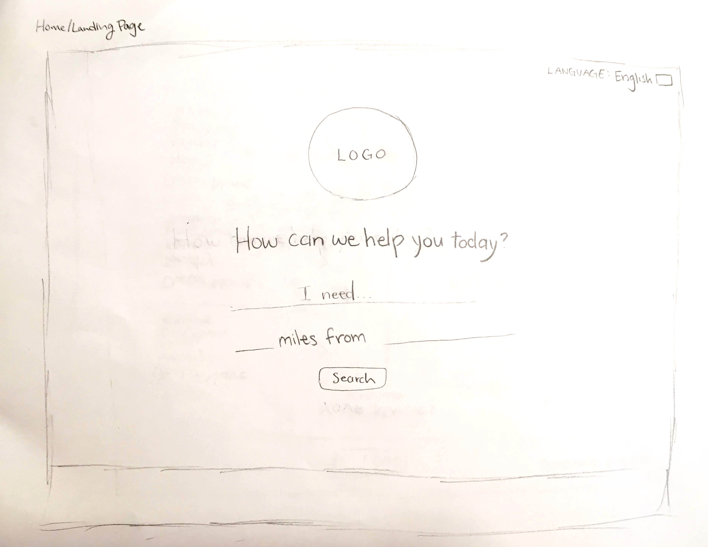

# LingoMD (Native Language Doctor)

#### Independent capstone project for Epicodus, 11.30.18

#### By Nikki Wong

## Description

<strong>Name of Student:</strong> Nikki Wong

<strong>Name of Project:</strong> Native Language Doctor

<strong>Project's Purpose or Goal:</strong> This application is intended to help immigrants and other individuals whose first language is not English to find physicians and other healthcare providers who speak their native language in their area.

<strong>Absolute Minimum Features:</strong>
* Users can search for a doctor by keyword
* Users can narrow down results by language(s) spoken
* Users can narrow down results by geographic location
* Search queries call the BetterDoctor API to provide and filter data

<strong>Tools, Frameworks, Libraries, APIs, Modules and/or Other Resources To Be Used:</strong>
* Redux
* React
* BetterDoctor API

<strong>Additional Features/Stretch Goals:</strong>
* Map view of results using Google Maps API or another maps REST API
* Well-developed user interface/design
* Implementation of a web translator to auto-translate the site into other languages

<strong>Additional Tools, Frameworks, Libraries, APIs, or Other Resources For Additional Features:</strong>
* Google Maps or another maps REST API
* SASS
* Animate on Scroll library
* Google Translate API

## Planning

### Sketches

#### Landing Page

#### Results Page

#### Results Detail Page

### Lo-fi Wireframes

#### Landing Page

#### Results Page

#### Results Detail Page

## Setup on OSX

* Clone this repository
* Run `npm install`

## Development server

Run `npm run start` for a dev server. Navigate to `http://localhost:8080/`. The app will automatically reload if you change any of the source files.

## Technologies Used

* React
* Babel
* Webpack

## Notes

## License

Copyright (c) 2018 **Nikki Wong**
